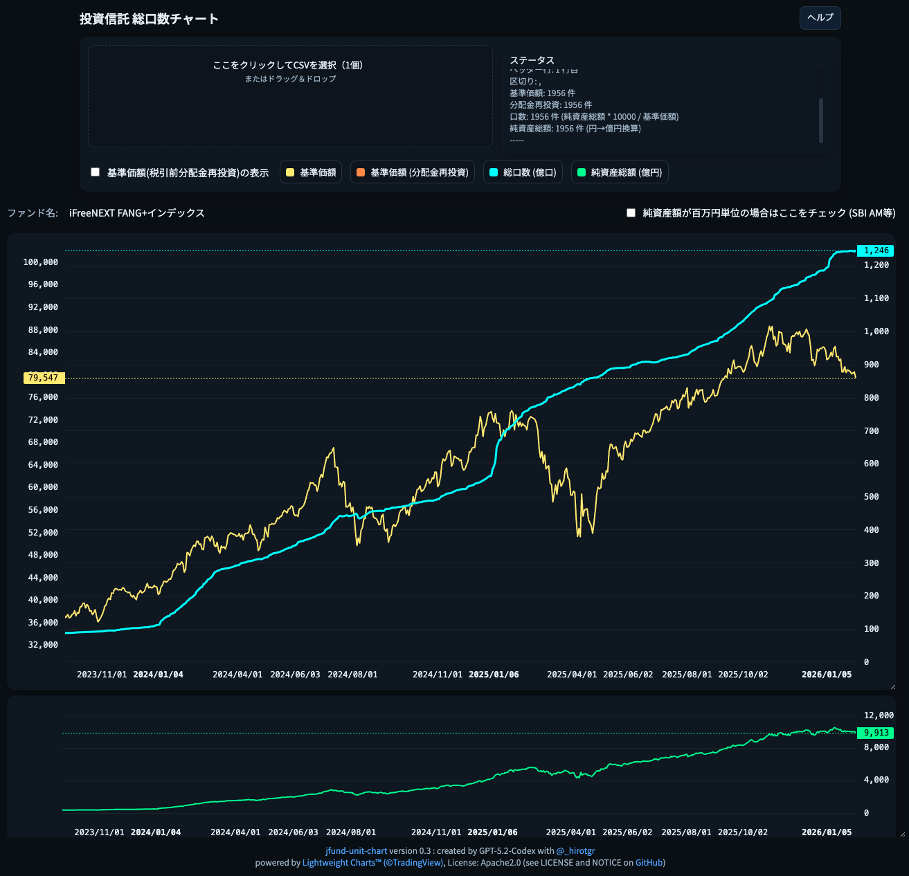

# 概要

* 投資信託の基準価額CSVファイルを読み込むと総口数をチャート描画できます。
* 純資産総額が「百万円」単位のCSVファイルは自動判定(推測)できません。**純資産額が百万円単位の場合はここをチェック**をチェックしてください。
* CSVファイルの1行目にファンド名が記載されていればそれを利用します。
* CSVファイルの1行目にファンド名が記載されていない場合は、ファイル名をファンド名として利用します。
* ツールのヘルプを参照してください。

# GitHub Pages

* [https://hirotgr.github.io/jfund-unit-chart/](https://hirotgr.github.io/jfund-unit-chart/)
* 価額データは各投資信託運用会社のWebサイトからCSVファイルをダウンロードしてください。

# ダウンロード

このツールはHTMLファイル単体で機能するので「名前を付けて保存」などでローカルにダウンロードして使用することができます。 
`index.html`を `jfund-unit-chart.html`などに名前変更して保存してください。

* [index.html](https://raw.githubusercontent.com/hirotgr/jfund-unit-chart/main/index.html)

# 使用イメージ

